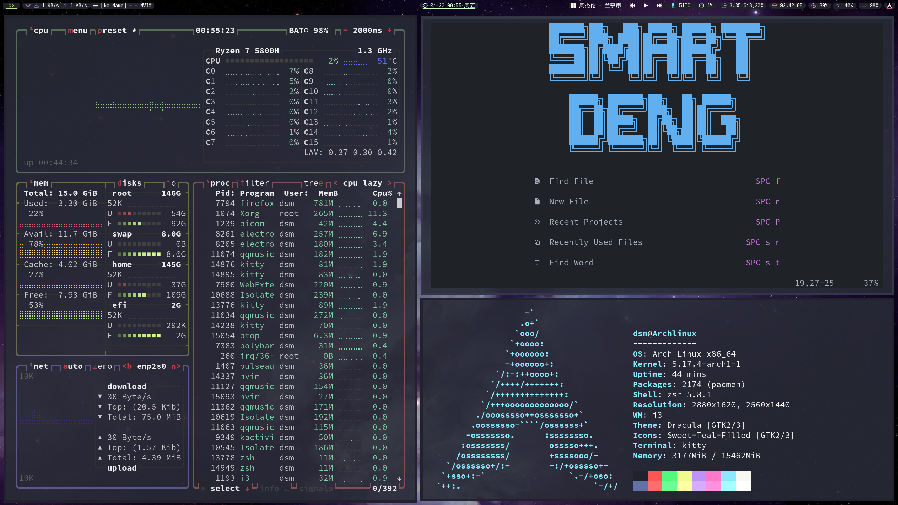

# Archlinux
Some usefull configuration in my Archlinux.
Arch Linux is The Best!


## i3wm & Polybar
### Dependencies
Install the following packages with yay.
- Base: 
  base-devel wget curl git gcc make acpi light pulseaudio pulseaudio-alsa alsa-utils pacman-contrib mpc
- WM & X11:
  i3-gaps i3blocks i3lock-color xorg xorg-xinit xorg-server
- Programs:
  kitty rofi dunst (with libnotify) ranger ncmpcpp mpd polybar papirus-icon-theme btop sddm (with qt5 qt5-quickcontrols2 qt5-svg) zsh picom cava code neovim xclip scrot ffcast slop
- Emoji Fonts: 
  noto-fonts noto-fonts-emoji noto-fonts-extra noto-fonts-cjk
- For background:
  nitrogen

### Optional
See more packages in arch_install/packages-repo.txt

Then copy the i3, kitty, polybar directories in the dotfiles/.config to your ~/.config.

**Remeber to change the interface in polybar/modules/network.ini to your network interface. 

Sometimes you need to change the device id in temperature.ini.**

At last, relogin with i3wm. Enjoin it!.

## For vim8.1+
```
cp dotfiles/.vimrc ~/.vimrc
```
Then enter to vim, input this:
```
:PlugInstall
```
Wait some minutes until it finished
#### vimspector plugin settings
Copy the dotfiles/.vimspector.json to your $HOME path or Your Project Root path.

Run F5 to start the debug Launcher Just like VsCode.

See more details at [Vimspector.vim](https://github.com/puremourning/vimspector#installation)
#### asynctask Plugin
Copy the dotfiles/tasks.ini to you ~/.vim/ 

See more details at [skywind3000/asynctasks.vim](https://github.com/skywind3000/asynctasks.vim)
#### For Latex Support
Install texlive First.

To use vim with latex, install zathura with your package manager.

Then copy the directory dotfiles/.config/zathura to your ~/.config/

## For Neovim
I have migrated from vim to Neovim now.

Configurations files are in dotfiles/.config/nvim for Astrovim, and dotfiles/.config/lvim for LunarVim.

See more details in their Github repo.

## Urxvt
Copy dotfiles/.Xresources and dotfiles/.urxvt to Your $HOME path

## Fcitx5
If you use Fcitx5 as you input method, 

add these lines in you /etc/environment or .xinitrc or .xprofile or
just all of them, which depends on your need:
```
export LANG=en_US.UTF-8
export LANGUAGE=en_US.UTF-8
export LC_CTYPE=zh_CN.UTF-8
export QT_IM_MODULE=fcitx5
```
## zsh
Install oh-my-zsh first.

Then install [zsh-autosuggestions](https://github.com/zsh-users/zsh-autosuggestions), [zsh-syntax-highlighting](https://github.com/zsh-users/zsh-syntax-highlighting), [zsh-completions](https://github.com/zsh-users/zsh-completions) in your oh-my-zsh.

Copy the dotfiles/.zshrc and dotfiles/.p10k.zsh to your $HOME path

## arch_install scripts
Some scripts and config files to help installing a new Arch Linux.

see more about init.sh and install.sh

## Others
I use i3wm, sometimes AwesomeWM. 

My terminal is kitty. 

See more in my dotfiles/.config directory.
