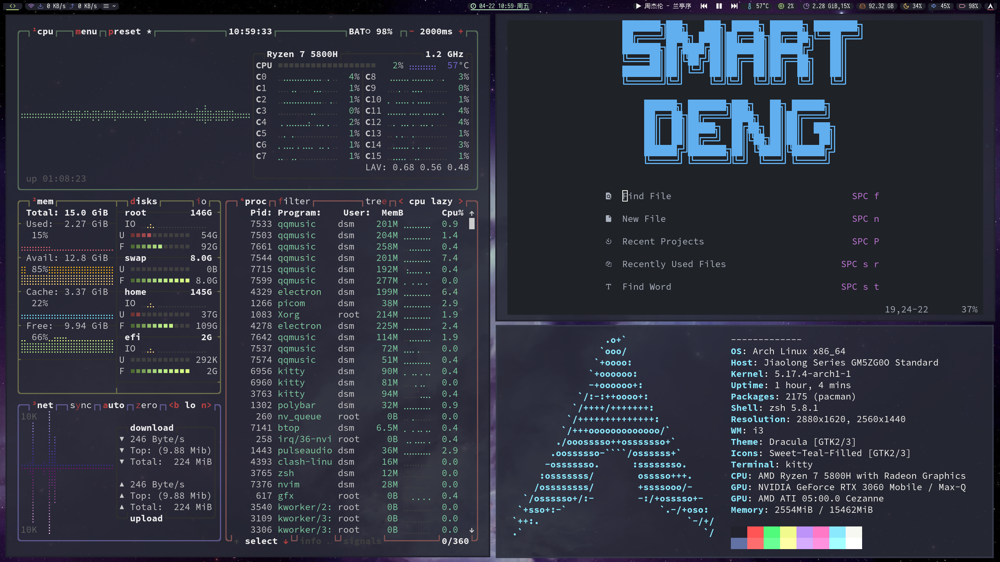

# Archlinux
Some usefull configuration in my Archlinux.
Arch Linux is The Best!


## vimrc
```
cp dotfiles/.vimrc ~/.vimrc
```
Then enter to vim, input this:
```
:PlugInstall
```
Wait some mins
#### vimspector plugin settings
Copy the dotfiles/.vimspector.json to your $HOME path or Your Project Root path.
Run F5 to start the debug Launcher Just like VsCode.
See more details at [Vimspector.vim](https://github.com/puremourning/vimspector#installation)
#### asynctask Plugin
Copy the dotfiles/tasks.ini to you ~/.vim/
See more details at [skywind3000/asynctasks.vim](https://github.com/skywind3000/asynctasks.vim)
#### Latex
To use vim with latex, install zathura with your package manager.
Then copy the directory dotfiles/.config/zathura to your ~/.config/

## Urxvt
Copy dotfiles/.Xresources and dotfiles/.urxvt to Your $HOME path

## Fcitx5
If you use Fcitx5 as you input method, add these lines in you /etc/environment or .xinitrc or .xprofile or
just all of them, which depends on your need:
```
export LANG=en_US.UTF-8
export LANGUAGE=en_US.UTF-8
export LC_CTYPE=zh_CN.UTF-8
export QT_IM_MODULE=fcitx5
```
## zsh
Install oh-my-zsh first.
Then install [zsh-autosuggestions](https://github.com/zsh-users/zsh-autosuggestions), [zsh-syntax-highlighting](https://github.com/zsh-users/zsh-syntax-highlighting), [zsh-completions](https://github.com/zsh-users/zsh-completions) in your oh-my-zsh.
Copy the dotfiles/.zshrc and dotfiles/.p10k.zsh to your $HOME path

## arch_install scripts
Some scripts and config files to help installing a new Arch Linux.
see more about init.sh and install.sh

## Others
I use i3wm, sometimes AwesomeWM. My terminal is kitty. See more in my dotfiles/.config directory.
